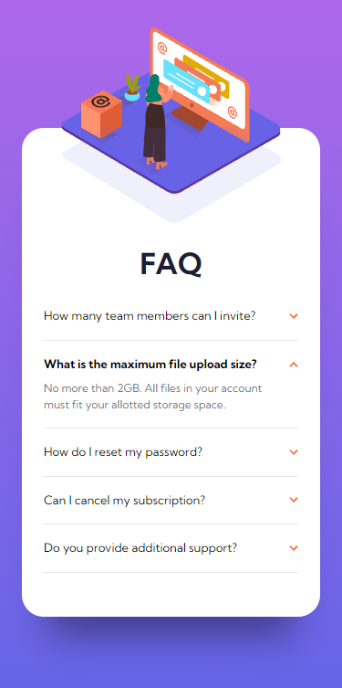
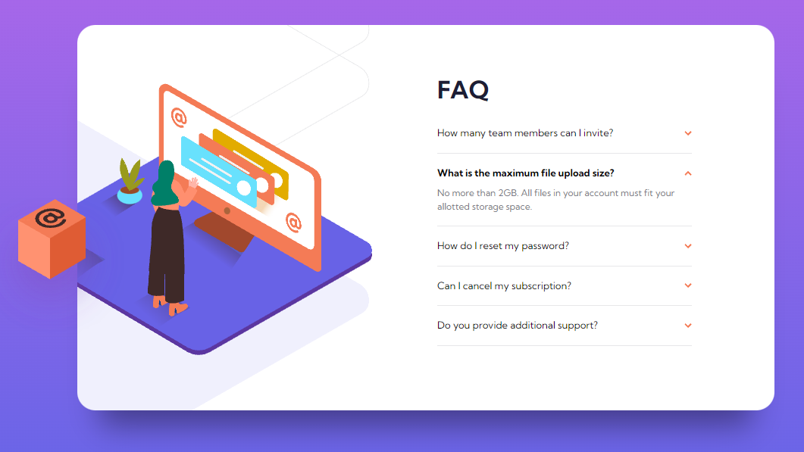

# Frontend Mentor - FAQ accordion card solution

This is a solution to the [FAQ accordion card challenge on Frontend Mentor](https://www.frontendmentor.io/challenges/faq-accordion-card-XlyjD0Oam). Frontend Mentor challenges help you improve your coding skills by building realistic projects.

## Table of contents

- [Overview](#overview)
  - [The challenge](#the-challenge)
  - [Screenshot](#screenshot)
  - [Links](#links)
- [My process](#my-process)
  - [Built with](#built-with)
  - [What I learned](#what-i-learned)

## Overview

### The challenge

Users should be able to:

- View the optimal layout for the component depending on their device's screen size
- See hover states for all interactive elements on the page
- Hide/Show the answer to a question when the question is clicked

### Screenshot




### Links

- Live Site URL: [LIVE SITE](https://your-live-site-url.com)

## My process

### Built with

- Semantic HTML5 markup
- CSS custom properties
- Flexbox
- CSS Grid
- Mobile-first workflow

### What I learned

#### Accordion using CSS and HTML only, using input type checkbox (can be change to radio button if you want only one to be open at a time)

```html
<li>
  <input type="checkbox" name="accordion" id="first" />
  <label for="first"
    >How many team members can I invite?
    </label>
  <div class="content">
    <p>
      You can invite up to 2 additional users on the Free plan. There is no
      limit on team members for the Premium plan.
    </p>
  </div>
</li>
<div class="divider"></div>
<li>
  <input type="checkbox" name="accordion" id="second" checked />
  <label for="second"
    >What is the maximum file upload size?
    </label>
  <div class="content">
    <p>
      No more than 2GB. All files in your account must fit your allotted storage
      space.
    </p>
  </div>
</li>
```

```css
#accordion input[type="checkbox"] {
  display: none;
}

#accordion .content {
  max-height: 0;
  overflow: hidden;
  color: var(--clr-secondary-200);
  max-width: 90%;
}

#accordion input[type="checkbox"]:checked ~ .content {
  max-height: 400px;
  margin-top: 0.5rem;
}

#accordion input[type="checkbox"]:checked + label {
  font-weight: bold;
}
```
